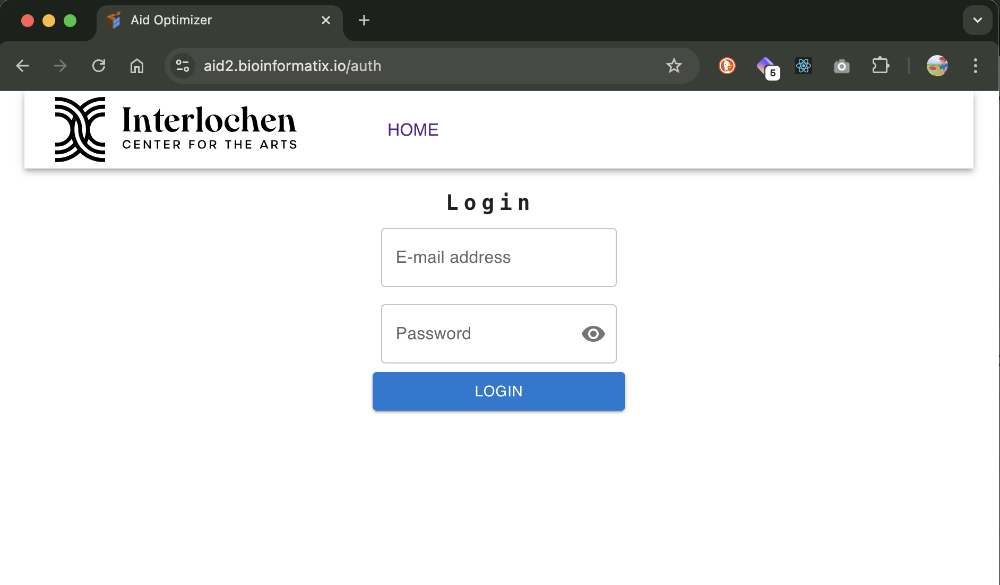
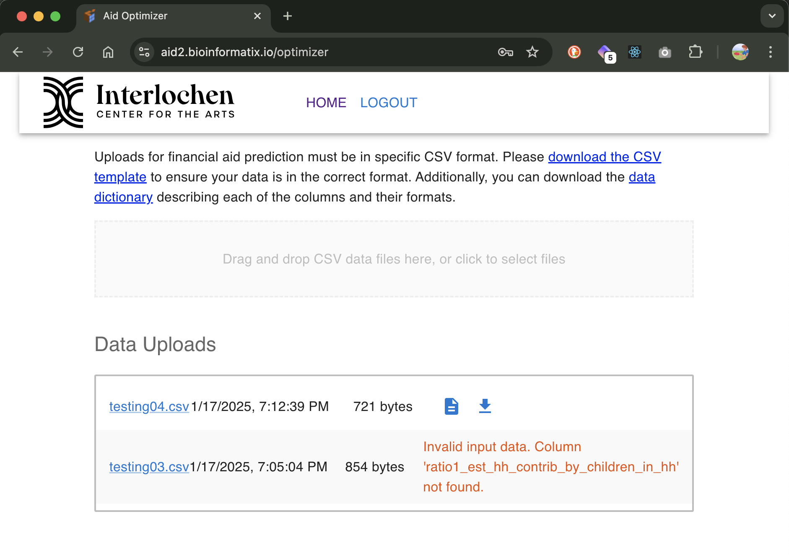
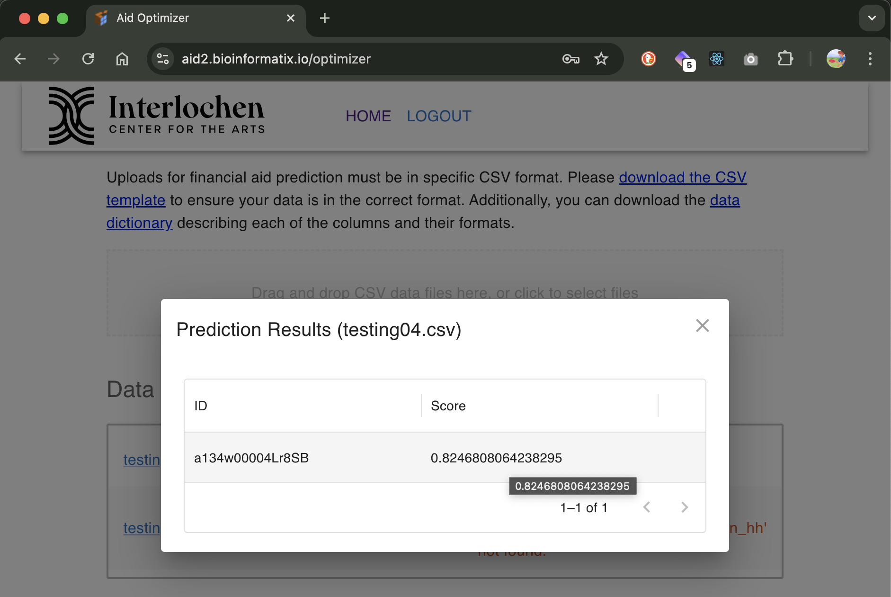

# Aid Optimizer

This react app is a frontend for an API designed to predict financial aid needed by a
student based on numerous inputs using machine learning models.

## Screenshots

### Login Screen

### Home Screen

### Results Screen

## Installation

yarn install

## Usage

### Authentication

By default, the app relies on a backend server to authenticate users. The backend server is located in the `aidapi` directory. The backend server is a Python/Django application that uses Django Rest Framework to authenticate users.

### Configuration

It relies on `AIDOPTIMIZER_API_URL` environment variable to define the API URL and relies on token authentication.

## Testing

1. Start the backend server in `aidapi` directory with `python3 manage.py runserver`

   - The backend server should be running on `http://localhost:8000`

2. Set NODE_ENV to development

   - `export NODE_ENV=development`

3. Start the frontend server with `yarn start`
